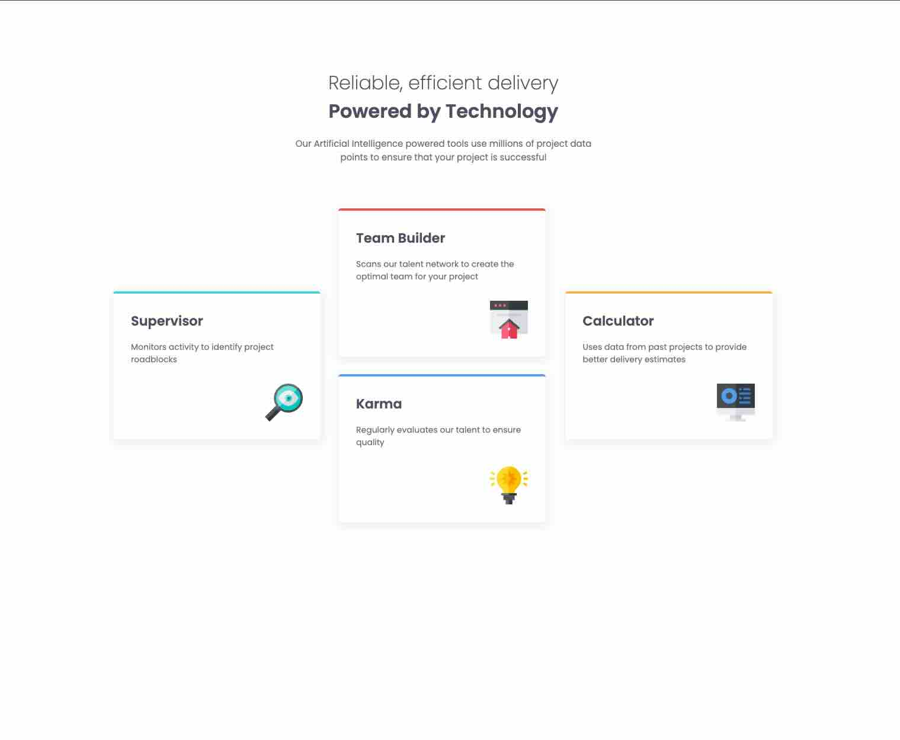

# Frontend Mentor - Four card feature section solution

This is a solution to the [Four card feature section challenge on Frontend Mentor](https://www.frontendmentor.io/challenges/four-card-feature-section-weK1eFYK). Frontend Mentor challenges help you improve your coding skills by building realistic projects.

## Table of contents

- [Overview](#overview)
  - [The challenge](#the-challenge)
  - [Screenshot](#screenshot)
  - [Links](#links)
- [My process](#my-process)
  - [Built with](#built-with)
  - [What I learned](#what-i-learned)
- [Author](#author)

## Overview

### The challenge

Users should be able to:

- View the optimal layout for the site depending on their device's screen size

### Screenshot



### Links

- Solution URL: [GitHub](https://github.com/ikokolius/four-card-feature-section)
- Live Site URL: [Live](https://ikokolius.github.io/four-card-feature-section/)

## My process

### Built with

- Semantic HTML5 markup
- Sass
- Flexbox
- CSS Grid
- Mobile-first workflow

### What I learned

I learned sass modules and functions and gained experience with CSS Grid.
For example, we can easily convert pixels to rems with:

```scss
@use 'sass:math';

@function pxToRem($pxValue) {
  @return math.div($pxValue, 16px) * 1rem;
}
```

## Author

- Frontend Mentor - [Iryna Kokolius](https://www.frontendmentor.io/profile/ikokolius)
- LinkedIn - [Iryna Kokolius](https://www.linkedin.com/in/iryna-kokolius/)
